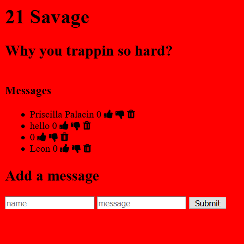

### Full Stack Demonstration

# Goal: Create full stack app that will let user add, change, delete, and see information from a database
## How it's done:
- Server is set up to be able to handle requests that come from browser side JS and forms
- Form is set up that has a field for topic and comment
- When a submission is sent in, a post request is made to the server which in turn takes the body of the request and stores it in a database, the page is then reloaded
- Each comment is created with icons for upvoting, downvoting, and deletion
- All icons have event listeners that will act based on request, they will make either put or delete requests to the server which will in turn change the database
## Installation

1. Clone repo
2. run `npm install`

## Usage

1. run `npm run savage`
2. Navigate to `localhost:3000`
